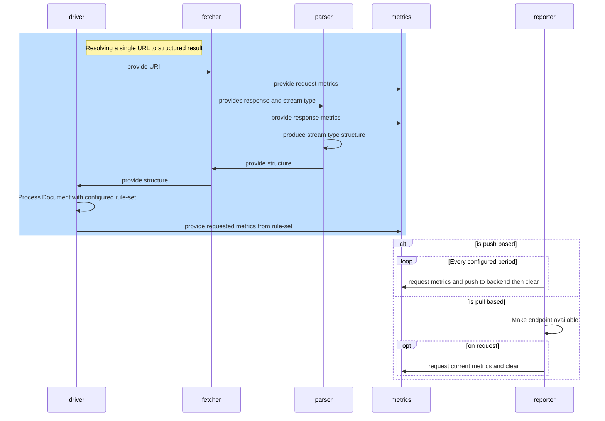

```mermaid

sequenceDiagram
    %% Driver is either the CLI or server daemon of the tool responsible for calling the subsequent units
    participant driver

    %% Fetcher is the component responsible for converting a network URL into raw bytes.
    participant fetcher

    %% Parser is the component responsible for taking the raw bytes from fetcher and turning it into a structured response 
    %% The structured response can then be given to the driver to decide what to do with it.
    participant parser

    %% Metrics is an interface responsible for receiving telemetry in a way that the reporter package can implement. 
    %% Using their specific counters / spans / gauge, etc.
    participant metrics

    %% Reporter is the underlying specific reporting toolset collector. Ex: OpenTelemetry, Prometheus, etc.
    participant reporter
    
    rect rgb(191, 223, 255)
    note right of driver: Resolving a single URL to structured result
    
    driver->>fetcher: provide URI
    fetcher->>metrics: provide request metrics
    fetcher->>parser: provides response and stream type
    fetcher->>metrics: provide response metrics
    parser->>parser: produce stream type structure
    parser->>fetcher: provide structure
    fetcher->>driver: provide structure
    driver->>driver: Process Document with configured rule-set
    driver->>metrics: provide requested metrics from rule-set
    end

    
    
    alt is push based
    loop Every configured period
        reporter->>metrics: request metrics and push to backend then clear
    end
    else is pull based 
    reporter->>reporter: Make endpoint available
        opt on request
            reporter->>metrics: request current metrics and clear
        end
    end
```