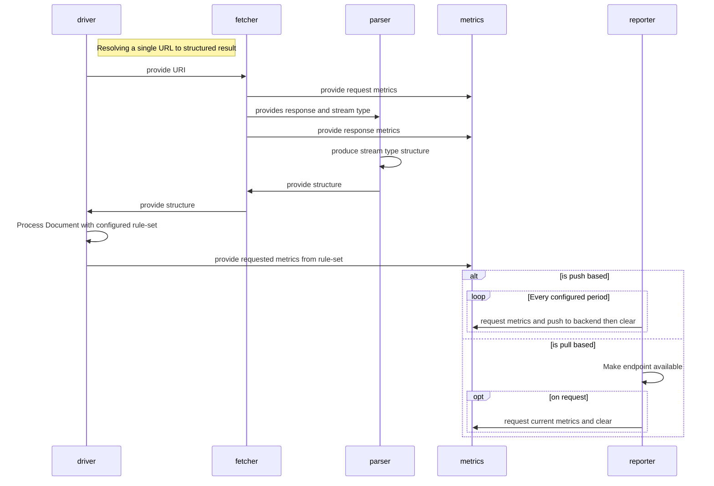

## Data Flow

| Name     | Description                                                                 |
| -------- | --------------------------------------------------------------------------- |
| driver   | The CLI or Daemon reponsible for calling subsequent units of work           |
| fetcher  | Responsible for converting a network URL into raw bytes.                    |
| parser   | Responsible for taking raw bytes and truning it into a structured response. |
| metrics  | An interface responsible for defining the telemetry we want to support.     |
| reporter | The underlying reporting toolset. Ex: OpenTelemetry, Prometheus.            |

